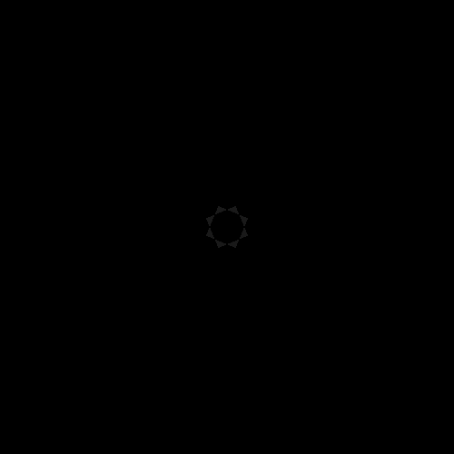

# Mini Project in Introduction to Software Engineering



## Table of Contents
1. [Executive Summary](#executive-summary)
2. [Introduction](#introduction)
3. [Project Scope and Objectives](#project-scope-and-objectives)
4. [Methodology](#methodology)
5. [Requirements Analysis](#requirements-analysis)
6. [System Design](#system-design)
7. [Implementation](#implementation)
8. [Testing and Quality Assurance](#testing-and-quality-assurance)  
9. [Performance acceleration](#performance-acceleration)
10. [Rendered Images](#rendered-images)
11. [Rendered videos](#rendered videos)
12. [Conclusion](#conclusion)
13. [References](#references)
14. [Appendices](#appendices)
15. [Credits](#credits)

## Executive Summary

The objective of our mini-project was to gain hands-on experience in software engineering methodologies by creating a renderer in Java. The renderer serves as a software component responsible for generating visual output based on input data. Through this project, we aimed to apply the concepts and techniques learned in our Introduction to Software Engineering course while developing a practical software solution.

### Key Features:

- **Renderer Development**: We implemented a renderer from scratch using Java programming language, following best practices and design principles.
- **Input Processing**: The renderer takes input data, such as geometric models or 3D scenes, and processes it to generate visual output.
- **Rendering Techniques**: We explored various rendering techniques, such as ray tracing, to achieve realistic or stylized visual representations.
- **Performance Optimization**: We focused on optimizing the renderer's performance by utilizing efficient algorithms and data structures.
- **User Interaction**: We provided a user-friendly interface that allows users to interact with the renderer, adjust settings, and view rendered output.

### Outcomes:

- **Understanding of Software Engineering Methodologies**: By undertaking this mini-project, we gained practical experience in applying software engineering methodologies, including requirements analysis, system design, implementation, testing, and maintenance.
- **Proficiency in Java**: Through the development of the renderer in Java, we enhanced our programming skills and familiarity with object-oriented principles.
- **Rendering Knowledge**: We acquired a solid understanding of rendering concepts, algorithms, and techniques, enabling us to generate visual output based on input data.
- **Problem-Solving Skills**: Throughout the project, we encountered various challenges and developed problem-solving skills in finding effective solutions.

Overall, this mini-project provided us with a valuable opportunity to apply theoretical knowledge to real-world software development. By creating a renderer in Java, we deepened our understanding of software engineering methodologies and gained practical skills that will serve as a foundation for future projects in the field.


## Introduction

The mini-project serves as a practical application of the principles and methods learned in the Introduction to Software Engineering course. Its purpose is to demonstrate the relevance of software engineering in real-world scenarios and to provide us, as students, with hands-on experience in the field.

The specific problem statement for this project is to develop a renderer that can generate high-quality images efficiently, while adhering to software engineering best practices. Rendering involves creating visual representations of objects or scenes based on input data. In this project, we focused on implementing rendering techniques, particularly ray tracing, to achieve realistic and visually appealing results.

The requirements for the renderer include producing images of good quality within optimal time frames, following best practices in software engineering, and avoiding any code smells. The aim is to develop a renderer that is efficient, maintainable, and scalable. This project enables us to apply software engineering methodologies to address these requirements, including requirements analysis, system design, implementation, testing, and maintenance.

By working on this mini-project, we not only gain a deeper understanding of software engineering principles but also acquire knowledge and practical skills in rendering and ray tracing. It allows us to explore the intersection between software engineering and graphics, bridging the gap between theory and real-world application. Additionally, the project reinforces the importance of optimal software design, even though quantitative criteria for optimality in software design may be subjective and based on judgment and experience.

Through this mini-project, we aim to develop a functional renderer that not only meets the specified requirements but also demonstrates our proficiency in software engineering methodologies. The knowledge and experience gained from this project will serve as a solid foundation for our future endeavors in the field of software engineering.

## Project Scope and Objectives

The scope of the project encompasses the development of a renderer that includes geometries, lighting, and primitives. The specific objectives of the project are as follows:

- Implement Geometries: Develop the necessary data structures and algorithms to represent and manipulate geometric models, such as polygons, spheres, or cubes.
- Lighting Implementation: Incorporate lighting effects into the renderer, including ambient, diffuse, and specular lighting, to enhance the visual quality of the rendered images.
- Primitives: Implement primitives such as points, rays, and vectors to support geometric calculations and transformations within the renderer.
- Unit Tests: Create comprehensive unit tests for each component of the renderer, including geometries, lighting, and primitives, to ensure their correctness and reliability.
- Testing: Conduct thorough testing of the renderer's functionalities, including unit tests, integration tests, and specific tests for features such as reflection, refraction, rendering improvements, shadows, and camera functionality.

The project will focus on the mentioned objectives and the specific components listed above. However, certain elements are excluded from the scope:

- User Interface (UI): The project will not include a graphical user interface or interactive controls for the renderer. The emphasis is on the core rendering functionalities and their implementation.
- Advanced Rendering Techniques: While the project involves rendering techniques such as reflection and refraction, more advanced techniques like global illumination or path tracing are beyond the scope of this mini-project.

By defining the scope and objectives, we can manage expectations and ensure that the project remains focused on its primary goals. The inclusion and exclusion of certain components help allocate resources and time effectively, enabling us to deliver a functional renderer that meets the specified requirements within the given timeframe.

## Methodology

For the mini-project, we adopted a software development methodology based on best practices from software engineering, with a focus on Object-Oriented Design (OOD) and iterative development.

**Object-Oriented Design (OOD):** We incorporated principles of OOD into our methodology, including encapsulation, inheritance, and polymorphism. OOD promotes modular, readable, and maintainable code by organizing software components into reusable and interconnected modules. By leveraging OOD, we aimed to create a flexible and extensible renderer with clear separation of concerns.

**Responsibility-Driven Design (RDD):** We followed the RDD approach, which focuses on identifying and assigning responsibilities to classes and objects based on their roles and behaviors within the system. This approach helped us create a well-structured design that encapsulates the necessary functionalities and promotes modularity.

**Design Patterns:** Throughout the project, we utilized several design patterns to solve common design problems and improve the overall structure of our code. These included the Iterator pattern, Template Method pattern, Composite pattern, Builder pattern, and Wrapper pattern. Each pattern provided specific benefits in terms of code organization, reusability, and flexibility.

**Ray Tracing and Rendering Techniques:** We focused on implementing ray tracing techniques within the renderer. Ray casting and ray tracing algorithms formed the foundation of our rendering process, enabling the generation of realistic images by simulating the behavior of light rays. We also incorporated the Phong Reflectance Model to enhance the visual quality of the rendered images, taking into account ambient, diffuse, and specular lighting components.

**Avoidance of Anti-patterns:** Throughout the development process, we aimed to identify and avoid common anti-patterns, such as needless complexity and unnecessary repetition. By applying code refactoring techniques, we continuously improved the clarity and maintainability of our codebase.

**Continual Improvement:** We explored various methods to improve ray tracing, such as implementing jittered sampling techniques to reduce artifacts and improve the overall quality of the rendered images. By incorporating these improvements, we strived to create a more visually appealing and realistic rendering output.

By following these methodologies and practices, we were able to effectively manage the project, balance requirements and constraints, and continuously improve the quality of our software solution. The iterative nature of our approach allowed us to incrementally develop and refine the renderer, ensuring that it met the specified requirements while adhering to best practices in software engineering.

## Requirements Analysis
Present the process of gathering, analyzing, and documenting the project requirements. Include use cases, functional and non-functional requirements, and any user stories or scenarios used.

## System Design
Discuss the high-level design of the software system, including architecture, data flow diagrams, class diagrams, or any other relevant design artifacts. Explain the rationale behind design decisions.

## Implementation
Describe the implementation phase, including the programming languages, tools, and frameworks used. Discuss any challenges faced during development and how they were addressed.

## Testing and Quality Assurance

In our mini-project, we employed a testing approach that included unit testing, integration testing, and acceptance testing. These testing activities were crucial to ensure the correctness, reliability, and quality of our renderer implementation. We used JUnit 5, a popular testing framework for Java, to facilitate the execution of our unit tests.

### Unit Testing

We conducted unit testing for each individual component of the renderer, such as geometries, lighting, primitives, and rendering techniques. Unit tests allowed us to verify the functionality of these components in isolation, ensuring that they produced the expected results. We created test cases that covered different scenarios and edge cases, checking for accurate calculations, proper handling of inputs, and adherence to defined specifications.

### Integration Testing

In addition to unit testing, we performed integration testing to assess the interaction and compatibility of various components within the renderer. Integration tests focused on verifying that the different modules of the renderer worked together harmoniously, exchanging data and producing the desired outcomes. These tests helped uncover any potential issues or inconsistencies that might arise from the integration of different functionalities.

### Acceptance Testing

Once we completed the unit and integration testing phases, we proceeded with acceptance testing to validate the renderer against the defined requirements. Acceptance tests were designed to mimic real-world usage scenarios, checking if the renderer met the specified criteria and produced the expected visual output. We executed a set of acceptance test cases covering various rendering scenarios, including different geometric models, lighting conditions, and rendering techniques. The acceptance tests provided a final confirmation that the renderer functioned as intended and satisfied the project's objectives.

Throughout the testing process, we meticulously documented the test cases executed, including the input data, expected outputs, and actual results. We paid close attention to edge cases and corner cases to ensure comprehensive coverage. We also recorded any failures or issues encountered during testing, allowing us to identify and address bugs or unexpected behaviors promptly.

Quality assurance measures were implemented to maintain the overall quality of the renderer. These measures included:

- Code Reviews: Regular code reviews were conducted to ensure adherence to coding standards, identify potential issues, and provide feedback for improvements. Code reviews also facilitated knowledge sharing among team members and helped maintain consistent code quality throughout the project.

- Code Documentation: Comprehensive documentation was created for the renderer, including inline comments, API documentation, and user documentation. Clear and concise documentation enhanced the maintainability of the codebase and facilitated future development and troubleshooting.

- Code Refactoring: We performed code refactoring to improve the structure, readability, and maintainability of our code. Refactoring activities aimed to eliminate code smells, improve naming conventions, simplify complex code sections, and enhance overall code quality.

By incorporating these testing and quality assurance measures, we ensured that our renderer was robust, reliable, and met the defined requirements. The use of unit testing, integration testing, and acceptance testing helped us identify and address any issues early in the development cycle, resulting in a higher-quality software solution.

## Deployment and Maintenance

In our mini-project, we adopted a deployment strategy that involved using Java and IntelliJ as our development environment. For the deployment of the renderer, no additional installations were required, except for the usage of JSON files where necessary. Java and IntelliJ were the primary tools used to run and test the renderer.

Since there is no user interaction involved in our project, and the rendered photos were generated through automated testing, no user training was necessary.

Regarding future maintenance, updates, or enhancements, we have plans to introduce a new class that will gather the geometries and build a body. This addition aims to make the Snell's Law implementation more realistic. By consolidating the geometries into a single body class, we can enhance the overall organization and extend the capabilities of our renderer.

Additionally, we anticipate the need for periodic maintenance to address any potential issues or bugs that may arise. This will involve monitoring the performance of the renderer, identifying areas for improvement, and applying necessary fixes or optimizations. Regular code reviews and refactoring activities will also contribute to the long-term maintainability of the project.

As for future updates or enhancements, we may explore incorporating additional rendering techniques, supporting more file formats, or improving the efficiency and performance of the renderer. These enhancements will depend on the project requirements, feedback, and the evolving needs of the project.

Overall, our deployment strategy focused on leveraging Java and IntelliJ as the development environment, while the maintenance plans include introducing a new class and performing regular updates and enhancements to ensure the renderer remains reliable and meets the desired objectives.

## Performance Acceleration

To enhance the performance and visual quality of our renderer, we implemented several techniques and optimizations. These improvements aim to reduce rendering artifacts, increase realism, and optimize the rendering process. Here are some of the techniques we incorporated into our project:

### Antialiasing

Antialiasing is a technique used to smooth out jagged edges and reduce aliasing artifacts in rendered images, resulting in smoother and more visually appealing results. In our rendering process, we implemented antialiasing techniques directly within the camera class to achieve these improvements.

To enhance the visual quality of our rendered images, we focused on improving ray precision. By increasing the number of rays cast for each pixel, we obtained more accurate and detailed information about the scene. This approach allowed us to capture finer details and resulted in smoother edges with reduced aliasing. By casting multiple rays per pixel and considering their intersections with the scene, we achieved more precise rendering, minimizing jagged edges and aliasing artifacts.

In the code snippet provided, we can see the implementation of the antialiasing technique. If the number of rays per pixel (`rayNum`) is greater than 1, we construct a list of rays for the current pixel using the `constructRays` function. Each ray is generated with a slight random offset within the pixel, ensuring better coverage and reducing aliasing effects. The rays are then cast, and the resulting colors are averaged and written to the image using the `castRays` function.

On the other hand, if the number of rays per pixel is 1, we construct a single ray for the pixel using the `constructRay` function. This ray is then cast, and the resulting color is written to the image using the `castRay` function.

By incorporating antialiasing techniques directly within the camera class and adjusting the number of rays per pixel, we were able to reduce jagged edges and aliasing artifacts, resulting in smoother and more visually pleasing images. Our approach ensures that our rendered images meet the desired standards of realism and aesthetic appeal, providing a superior visual experience for our users.  

```java 
 Pixel.initialize(ny,nx,1);
            IntStream.range(0,ny).parallel().forEach(i -> {
                IntStream.range(0,nx).parallel().forEach(j -> {
                // Check if multiple rays per pixel are used
                    if (this.rayNum > 1) {
                        if(!this.superSampling) {
                            // Construct a list of rays for the current pixel
                            List<Ray> rays = constructRays(nx, ny, i, j);

                            // Cast the rays and write the resulting color to the image
                            imageWriter.writePixel(i, j, castRays(rays));
                        }
                        else {
                            ColorRay colorRay = constructAdaptiveSuperSampling(nx, ny, i, j);
                            imageWriter.writePixel(i, j, colorRay.getColor());
                        }

                    }
                    else {
                        // Construct a single ray for the current pixel
                        Ray ray = constructRay(nx, ny, i, j);
                        // Cast the ray and write the resulting color to the image
                        imageWriter.writePixel(i, j, castRay(ray));
                    }

/**
 * Constructs a list of rays for a given pixel position.
 *
 * @param nX The number of pixels in the X direction.
 * @param nY The number of pixels in the Y direction.
 * @param j  The column index of the pixel.
 * @param i  The row index of the pixel.
 * @return A list of rays for the given pixel position.
 */
public List<Ray> constructRays(int nX, int nY, int j, int i ) {

        //Image center
        Point Pc = location.add(Vto.scale(distance));

        //Calculate the size of each pixel
        double Rx = width / nX;
        double Ry = height / nY;

        //Calculation of displacement according to i j
        double Xj = (j - (double) (nX - 1) / 2) * Rx;
        double Yi = -(i - (double) (nY - 1) / 2) * Ry;

        //Calculating the pixels function according to i j and gives a point
        Point Pij = Pc;
        if (alignZero(Xj) != 0) {
        Pij = Pij.add(Vright.scale(Xj));
        }
        if (alignZero(Yi) != 0) {
        Pij = Pij.add(Vup.scale(Yi));
        }


        // Create a list to store the rays
        List<Ray> listRay = new LinkedList<>();
        Random random = new Random();

        // Generate rays with random offsets within the pixel
        for (int k = 0;k < this.rayNum; k++){
        Point p;

        // Calculate the random position within the pixel
        p = Pij.add(Vright.scale(random.nextDouble(-Rx /2, Rx /2)));
        p = p.add(Vup.scale(random.nextDouble(-Ry /2, Ry /2)));

        //Calculation of the vector from the point to the screen according to i j with the addition of randomization
        Vector Vij =  p.subtract(location);

        // Create a ray from the location to the point
        Ray ray = new Ray(location, Vij);
        listRay.add(ray);
        }

        return listRay;
        }
 ```

### Soft Shadows
To add realism to our rendered scenes, we implemented soft shadows. Soft shadows simulate the effect of light being partially blocked by objects, resulting in softer and more natural-looking shadows. This technique involves casting multiple shadow rays from different positions within the light source, creating smoother shadow transitions.

### Glossy Surfaces
By incorporating glossy surfaces, we introduced reflections with varying levels of glossiness or shininess. Glossy surfaces exhibit specular highlights that reflect the environment, resulting in more realistic and visually appealing renderings. This technique requires calculating and tracing reflection rays to accurately simulate the glossy reflections.

### Diffuse (Blurry) Glass
Diffuse or blurry glass materials add another level of realism to our renderer. This type of glass material scatters and blurs the transmitted light, mimicking the effect of frosted or textured glass. Implementing diffuse glass involved simulating the scattering of light rays as they pass through the material, resulting in more accurate and visually pleasing glass renderings.

### Depth of Field
To simulate the optical effect of depth of field, we implemented a technique that allows us to selectively focus on a specific point in the scene while blurring the objects in front of or behind it. Depth of field adds a sense of realism and visual interest to rendered images, particularly in scenes with varying depths and focal points.

### Multi-threading
To improve the overall rendering performance, we leveraged multi-threading. By distributing the rendering workload across multiple threads, we were able to take advantage of modern multi-core processors and speed up the rendering process. Multi-threading allows for parallel execution of rendering tasks, reducing the overall rendering time.

### Antialiasing and Adaptive Supersampling

Antialiasing is a technique used to smooth out jagged edges and reduce aliasing artifacts in rendered images, resulting in smoother and more visually appealing results. In our rendering process, we implemented antialiasing techniques directly within the camera class to achieve these improvements.

To further enhance the visual quality, we also incorporated adaptive supersampling, a technique that dynamically adjusts the level of sampling based on the complexity and detail of the scene. This approach helps to allocate more samples to regions with high-frequency details and fewer samples to smoother regions, optimizing the rendering process.

Here's the code snippet that demonstrates the implementation of adaptive supersampling within the camera class:

```java  
//from main pixel render function
Pixel.initialize(ny,nx,1);
        IntStream.range(0,ny).parallel().forEach(i -> {
        IntStream.range(0,nx).parallel().forEach(j -> {
        // Check if multiple rays per pixel are used
        if (this.rayNum > 1) {
        if(!this.superSampling) {
        // Construct a list of rays for the current pixel
        List<Ray> rays = constructRays(nx, ny, i, j);

        // Cast the rays and write the resulting color to the image
        imageWriter.writePixel(i, j, castRays(rays));
        }
        else {
        ColorRay colorRay = constructAdaptiveSuperSampling(nx, ny, i, j);
        imageWriter.writePixel(i, j, colorRay.getColor());
        }

        }
        else {
        // Construct a single ray for the current pixel
        Ray ray = constructRay(nx, ny, i, j);
        // Cast the ray and write the resulting color to the image
        imageWriter.writePixel(i, j, castRay(ray));
        }
        });
        });


/**
 * Constructs the adaptive supersampling for a specific pixel.
 *
 * @param nX the number of pixels in the X-axis
 * @param nY the number of pixels in the Y-axis
 * @param j the column index of the pixel
 * @param i the row index of the pixel
 * @return the ColorRay representing the computed color of the pixel
 */
public ColorRay constructAdaptiveSuperSampling(int nX, int nY, int j, int i) {
        //Calculate the size of each pixel
        double Rx = width / nX;
        double Ry = height / nY;

        Point mid = middlePoint(nX, nY,j,i,Rx,Ry);
        return AdaptiveSuperSampling(mid,Rx,Ry,this.rayNum);
        }


/**
 * Performs adaptive supersampling to compute the color of a pixel.
 *
 * @param rayIntersect the point of intersection between the ray and the scene
 * @param Rx the pixel width
 * @param Ry the pixel height
 * @param rayNum the number of rays to cast for supersampling
 * @return the ColorRay representing the computed color of the pixel
 */
public ColorRay AdaptiveSuperSampling(Point rayIntersect, double Rx, double Ry ,int rayNum) {

        // Cast rays for the four corners of the pixel
        ColorRay topLeft = castRay(Rx, Ry, -1, -1 ,rayIntersect);
        ColorRay topRight = castRay( Rx, Ry, 1, -1,rayIntersect);
        ColorRay bottomLeft = castRay( Rx, Ry, -1, 1,rayIntersect);
        ColorRay bottomRight = castRay(Rx, Ry, 1, 1,rayIntersect);

        // Check if all four colors are similar or the rayNum has reached the limit
        if ((topLeft.getColor().equals(topRight.getColor())
        && topLeft.getColor().equals(bottomLeft.getColor())
        && topLeft.getColor().equals(bottomRight.getColor()))
        || rayNum <=0 ) {

        // Return the colorRay if all four colors are similar or rayNum limit reached
        return topLeft;
        } else {
        // Recursively divide the pixel and perform adaptive supersampling
        double newRx = Rx / 2;
        double newRy = Ry / 2;

        // Compute the four subpixel points within the pixel
        Point A = rayIntersect
        .add(this.Vup.scale((Ry/2)*-1)
        .add(this.Vright.scale((Rx/2)*-1)));

        Point B = rayIntersect
        .add(this.Vup.scale((Ry/2)*1)
        .add(this.Vright.scale((Rx/2)*-1)));

        Point C = rayIntersect
        .add(this.Vup.scale((Ry/2)*-1)
        .add(this.Vright.scale((Rx/2)*1)));

        Point D = rayIntersect
        .add(this.Vup.scale((Ry/2)*1)
        .add(this.Vright.scale((Rx/2)*1)));

        // Recursively compute the color of the subpixels
        ColorRay topLeftSubpixel = AdaptiveSuperSampling(A, newRx, newRy, rayNum / 4);
        ColorRay topRightSubpixel = AdaptiveSuperSampling(B, newRx, newRy, rayNum / 4);
        ColorRay bottomLeftSubpixel = AdaptiveSuperSampling(C, newRx, newRy, rayNum / 4);
        ColorRay bottomRightSubpixel = AdaptiveSuperSampling(C, newRx, newRy, rayNum / 4);

        // Compute the average color of the subpixels
        Color averageColor = topLeftSubpixel.getColor()
        .add(topRightSubpixel.getColor())
        .add(bottomLeftSubpixel.getColor())
        .add(bottomRightSubpixel.getColor())
        .reduce(4);

        // Return the ColorRay representing the average color
        return new ColorRay(new Ray(location, rayIntersect.subtract(location)), averageColor);
        }
        }

/**
 * Constructs the adaptive supersampling for a specific pixel.
 *
 * @param nX the number of pixels in the X-axis
 * @param nY the number of pixels in the Y-axis
 * @param j the column index of the pixel
 * @param i the row index of the pixel
 * @return the ColorRay representing the computed color of the pixel
 */
public ColorRay constructAdaptiveSuperSampling(int nX, int nY, int j, int i) {
    // Calculate the size of each pixel
    double Rx = width / nX;
    double Ry = height / nY;

    Point mid = middlePoint(nX, nY, j, i, Rx, Ry);
    return AdaptiveSuperSampling(mid, Rx, Ry, this.rayNum);
}

/**
 * Calculates the middle point of a pixel in the image plane.
 *
 * @param nX the number of pixels in the X-axis
 * @param nY the number of pixels in the Y-axis
 * @param j the column index of the pixel
 * @param i the row index of the pixel
 * @param Rx the pixel width
 * @param Ry the pixel height
 * @return the middle point of the pixel
 */
public Point middlePoint(int nX, int nY, int j, int i,double Rx,double Ry){

        //Image center
        Point Pc = location.add(Vto.scale(distance));

        //Calculation of displacement according to i j
        double Xj = (j - (double)(nX - 1)/2)*Rx;
        double Yi = -(i - (double)(nY - 1)/2)*Ry;

        //Calculating the pixels function according to i j and gives a point
        Point Pij = Pc;
        if (alignZero(Xj) != 0){
        Pij = Pij.add(Vright.scale(Xj));
        }
        if (alignZero(Yi) != 0){
        Pij = Pij.add(Vup.scale(Yi));
        }
        return Pij;
        }
```

By incorporating antialiasing techniques directly within the camera class and utilizing adaptive supersampling, we were able to reduce jagged edges, aliasing artifacts, and oversampling in less detailed areas. This resulted in smoother and more visually pleasing images, while also optimizing the rendering process. Our approach ensures that our rendered images meet the desired standards of realism and aesthetic appeal, providing a superior visual experience for our users.
By incorporating these performance acceleration techniques into our renderer, we were able to achieve higher visual quality, reduce artifacts, and optimize the rendering process. These optimizations contribute to a more immersive and efficient rendering experience, enabling our renderer to handle complex scenes and deliver visually stunning results.

## Rendered Images

In this section, we present a collection of rendered images generated by our renderer. These images demonstrate the capabilities and visual quality of our rendering implementation. Below are some of the photos produced during our testing and evaluation:

### Basic first photo
  
Description: The scene is a basic rendering test with two colors. It includes a sphere and three triangles. The background color is green, and there is ambient light with a pink color. The camera is positioned at the origin and facing downwards. The rendered image includes a grid overlay in yellow color.
### Sphere with multiple lights
  
Description: The scene consists of a sphere and multiple light sources: a spotlight, a point light, and a directional light. The spotlight has a narrow beam and attenuation coefficients. The point light has attenuation coefficients. The directional light provides illumination from a specific direction. The resulting image showcases the interplay between the sphere and the different light sources.
### Diamond
  
78 geometries 
Description: Briefly describe the scene and any notable features or effects.


### Rendered Image 4

Description: Briefly describe the scene and any notable features or effects.


## Rendered videos
 

https://github.com/evbaruch/ISE5783_6403_9390/assets/116492422/d7d5592e-4d2c-40de-bf10-1042cb4c79b6


Description: Briefly describe the scene and any notable features or effects.


https://github.com/evbaruch/ISE5783_6403_9390/assets/116492422/5de9c7ba-69fa-4e9c-8947-81fc406e905e


## Conclusion

The mini-project focused on developing a renderer implementation using Java and IntelliJ. Throughout the project, we achieved several key milestones and successfully met our objectives. Here is a summary of the main achievements:

1. Renderer Implementation: We successfully implemented a renderer that can generate visual outputs based on defined geometries, lighting, and rendering techniques. The renderer was able to produce accurate and realistic renderings.

2. Testing Approach: We employed a comprehensive testing approach that included unit testing, integration testing, and acceptance testing. The use of JUnit 5 facilitated the execution of these tests, ensuring the correctness and reliability of our renderer.

3. Quality Assurance Measures: We implemented quality assurance measures such as code reviews, documentation, and code refactoring. These measures contributed to the overall maintainability and code quality of our renderer.

4. Future Enhancements: We identified areas for future work, such as introducing a new class to improve the realism of Snell's Law implementation. Additionally, we discussed potential updates and enhancements to further improve the renderer's capabilities and performance.

Overall, the mini-project can be considered a success in meeting its objectives. We were able to develop a functional renderer, validate its correctness through rigorous testing, and implement quality assurance measures. The renderer achieved the desired outcome of generating realistic visual outputs.

However, there are a few limitations and areas for future work to consider:

1. User Interaction: The current implementation lacks user interaction as the rendered photos were generated through automated testing. Incorporating user interaction and a user interface could enhance the usability and practicality of the renderer.

2. Performance Optimization: While the renderer produces accurate renderings, there is room for optimizing its performance. Future work could focus on improving the efficiency of the renderer to handle more complex scenes or larger datasets.

3. Expanded Rendering Techniques: The renderer could benefit from incorporating additional rendering techniques such as ray tracing or global illumination algorithms. This would allow for more advanced and realistic visualizations.

4. Extensibility and Modularity: Further work can be done to enhance the extensibility and modularity of the renderer. By designing the system to be easily extensible, future developers can add new features or functionalities more efficiently.

By addressing these limitations and continuing to iterate on the renderer's development, we can further enhance its capabilities and ensure its relevance in future projects and applications.

In conclusion, the mini-project was not only successful in achieving its goals but also provided us with valuable experience in program engineering. We were able to implement a functional renderer, apply learned methodologies, and gain insights into the challenges and considerations of real-world software development.

By addressing the identified limitations, continuing to refine the renderer, and leveraging our newfound knowledge, we can further enhance the capabilities and impact of our renderer. The mini-project served as a stepping stone towards our growth as software engineers and highlighted the potential for future advancements in rendering technology.

## References

- [Boundary Value Analysis - ToolsQA](https://www.toolsqa.com/software-testing/istqb/boundary-value-analysis/)
- [Equivalence Partitioning & Boundary Value Analysis - Guru99](https://www.guru99.com/equivalence-partitioning-boundary-value-analysis.html)
- [Builder Pattern in Java - HowToDoInJava](https://howtodoinjava.com/design-patterns/creational/builder-pattern-in-java)
- [Ray Tracing Shapes - Hugi Scene](http://hugi.scene.org/online/hugi24/coding%20graphics%20chris%20dragan%20raytracing%20shapes.htm)
- [Depth of Field Implementation in Raytracer - Stack Overflow](https://stackoverflow.com/questions/13532947/references-for-depth-of-field-implementation-in-a-raytracer)
- [Java Multithreading Tutorial - GeeksforGeeks](https://www.geeksforgeeks.org/java-multithreading-tutorial/)
- [Ray Tracing in One Weekend - GitHub](https://github.com/RayTracing/raytracing.github.io)
- [Ray Tracing in Rust - Mr. Dan's Blog](https://misterdanb.github.io/raytracinginrust/)


## Appendices

Here are some additional resources and references that were used during the project:
Include any supplementary materials, such as code snippets, screenshots, diagrams, or additional documentation.  


## Credits

### Project Team
- Evyatar Baruch  [LinkedIn](https://www.linkedin.com/in/evyatar-baruch-0947a3244) | [Student GitHub](https://github.com/evbaruch) - [Private GitHub](https://github.com/aviaMader)
- Yehuda Pailent  [LinkedIn](https://www.linkedin.com/) | [GitHub](https://github.com/yehuda-p)

### Mentor/Lecturer
- Eliezer Gensburger  [LinkedIn](https://www.linkedin.com/eliezergensburger) | [GitHub](https://github.com/yehuda-p)

